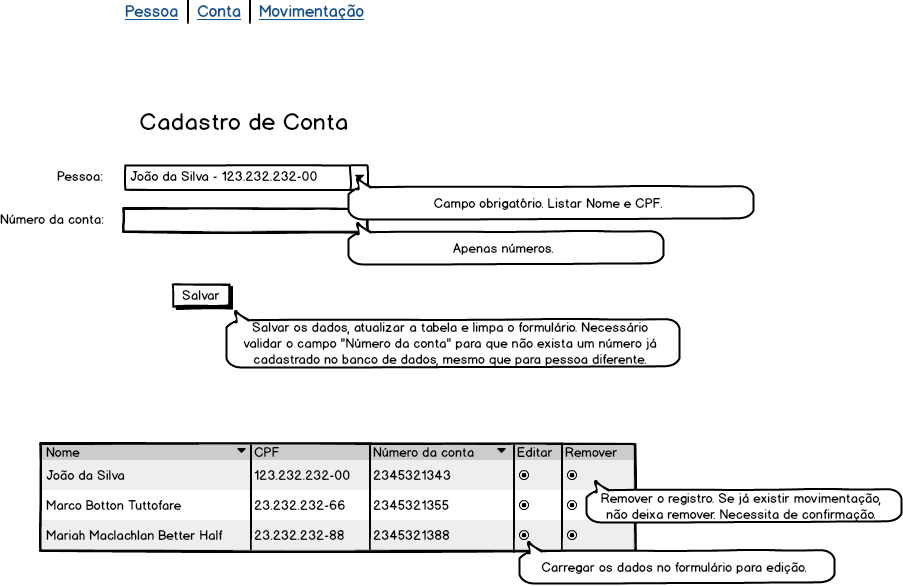

# Prova Fullstack React/Node Soluções Digitais

O desenvolvimento da prova consiste em desenvolver um sistema, conforme especificado nos protótipos abaixo.

**Cadastro de pessoa**

**Cadastro de conta**

**Cadastro de movimentação**

Para a realização da prova, deve-se utilizar a linguagem de programação **Javascript**.

Alguns pontos em relação ao desenvolvimento: 
- Fique a vontade para adicionar bibliotecas e ferramentas externas, caso ache necessário.
- Existe uma pasta de exemplo no projeto backend para realizar as operações com o banco de dados.
- Organize os arquivos do projeto de uma forma adequada (MVC), e tenha boas praticas.
- Existe o arquivo API na pasta `src/tools` no projeto Frontend que serve para conexão com o backend.

## Configuração do Projeto

Necessário a instalação do MongoDB: https://www.mongodb.com/docs/manual/installation

Acreditamos que o node também já estaja instalado mas caso não esteja: https://nodejs.org/en/download

O banco de dados `atividade-pratica` já esta definido no arquivo de conexão, criar apenas um documento no banco de dados contendo todas as informações necessárias(pessoa, conta e movimentação). 
Após o clone do projeto no **GitHub**, ir via terminal na pasta extraida e executar o comando em cada um dos projetos para subir a aplicação:
 - Frontend: `npm install`
 - Frontend: `npm run dev`
 - Backend: `npm install`
 - Backend: `npm run dev`

**Atenção:** Se atentar que não pode haver nenhum serviço rodando nas portas `5173` e `3000` no computador utilizado para a realização da prova, se tiver, será necessário fechar todos os serviços que utilizam essas portas.

Para verificar se a aplicação subiu corretamente digitar no navegador http://localhost/5173, deverá mostrar uma tela inicial com **Hello World!**

Para verificar os dados na base de dados aconselhamos a utilizar o Studio 3T: https://studio3t.com/download/

**Atenção:** Ao publicar fique atento ao para mandar no repositorio compartilhado com você e não no pessoal.

No mais, desenvolva com qualidade e boa prova! :)